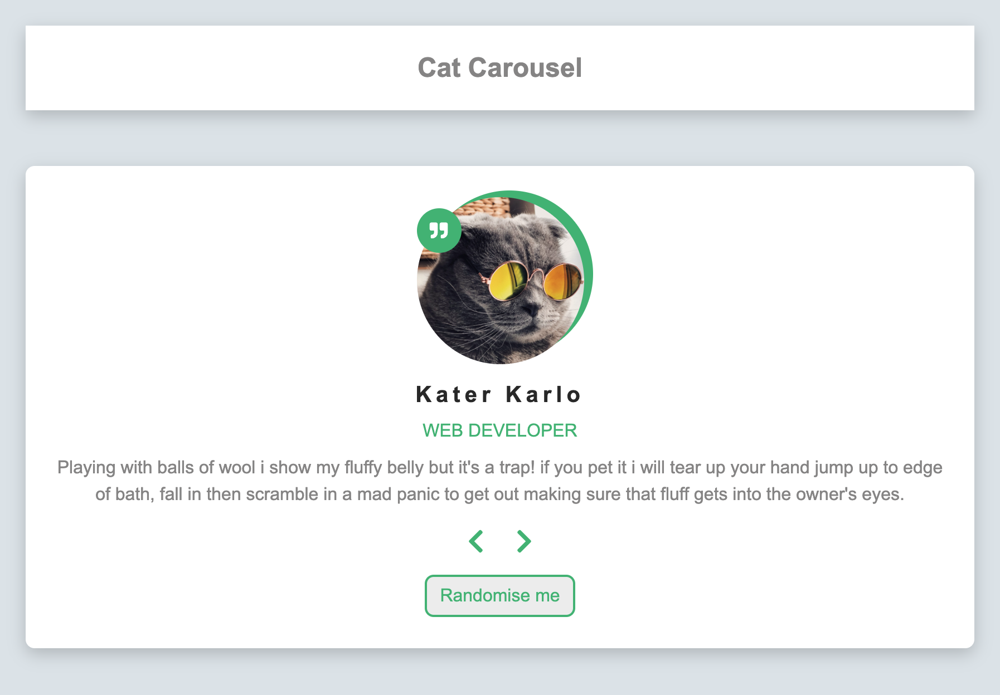
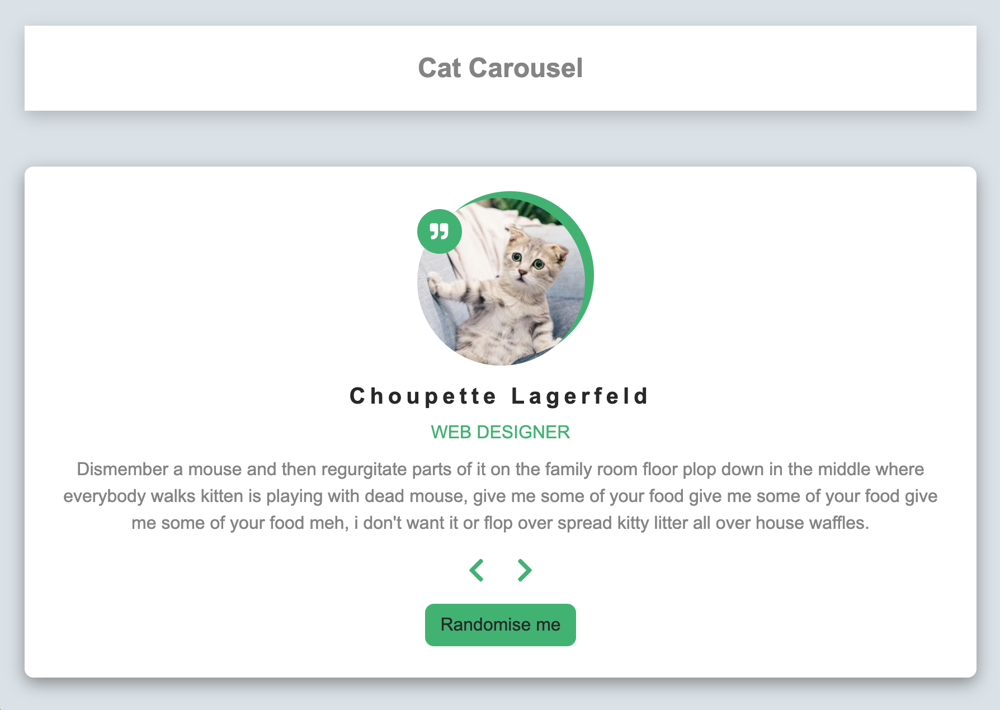

# Cat Carousel

## What is this about?

A simple carousel with clickable previous and next button that take you to previous/next slide. Additionally a random button that randomises displayed slide on click.

### Sources

- Starting point: [FreeCodecamp article - 40 JavaScript courses for Beginners](https://www.freecodecamp.org/news/javascript-projects-for-beginners/)
- See this link for [the carousel/review part in that article](https://www.freecodecamp.org/news/javascript-projects-for-beginners/#how-to-create-a-review-carousel)

Author/Creator of that carousel/review is John Smilga

- [YouTube video carousel/review](https://www.youtube.com/watch?v=3PHXvlpOkf4&t=2644s)
- [John Smilga's carousel/review on GitHub](https://github.com/john-smilga/javascript-basic-projects/tree/master/03-reviews)
- [Overview of the JavaScript projects, John Smilga created](https://www.vanillajavascriptprojects.com/)

### Visuals - what you get with this code

### Tech

- simple HTML, CSS, JavaScript, no build process
- use of `all.min.css` from font awesome for quote right icon and chevron left/chevron right (https://cdnjs.com/libraries/font-awesome)

### How to run this?

- clone the repo
- cd into project
- open `index.html` in your browser of choice
